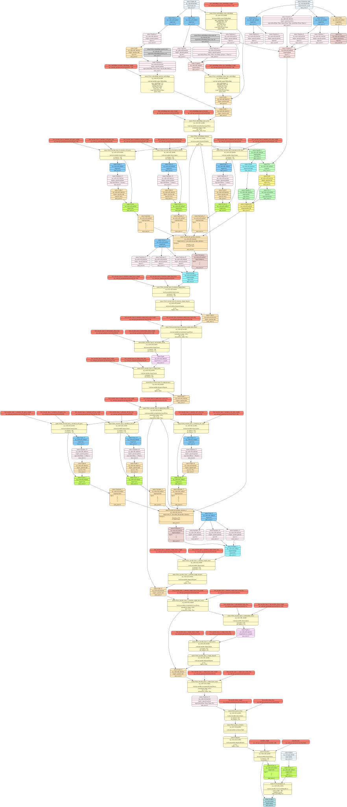
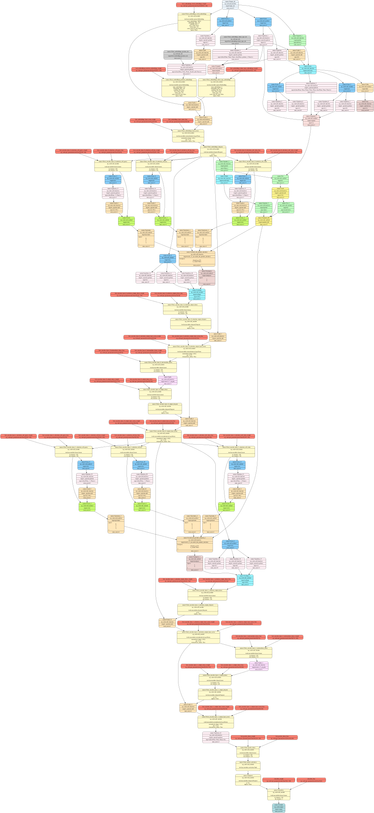
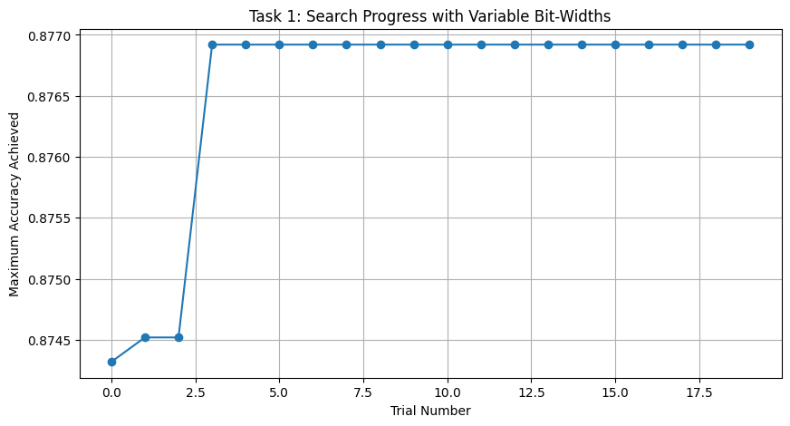
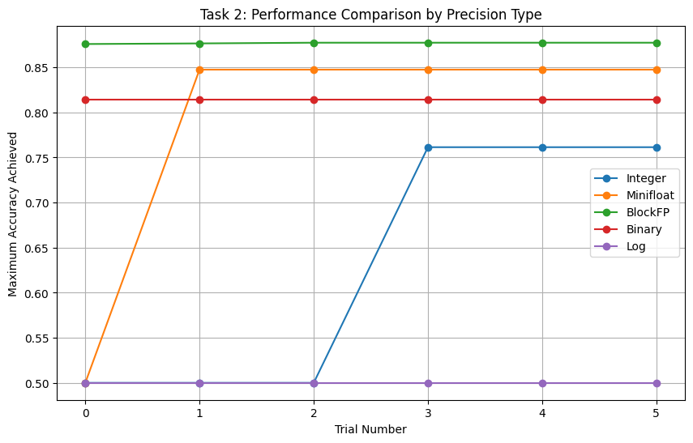

# LAB 0

## Tutorial 1 key points:

* overview of MG Nodes
* basic passes (analysis / transform)

## Tutorial 2:

* setup MG - selecting which inpuits of the forward pass function to use. 
* the topology of the graph with attention mask + labels vs without:

with:

without:


    * labels: adds nodes to the bottom of the graph that takes the labels and finds the cross entropy loss
    * attention mask: adds placeholder node to get attention mask (without it uses torch.ones), which is used to inform the attention layer.

* then did full supervised finetuneing (on layers that aren't embedding related) acheiveing 0.81 accuracy
* finally did PEFT achierveing 0.83 accuracy

# LAB 1

## Tutorial 3:

* quantization pass: accuracy went 0.83 -> 0.815
* PQT: accuracy 0.815 ->0.839

## Tutorial 4:

* Random pruneing: 0.839 -> 0.75
* After training: 0.75 -> 0.83

## Quantisation / pruning sweeps

* did a sweep of quantization bit-widths:
[quantisation sweep](mdassets/ptq_sweep.png)
* we can see that after 8 bits, accuracy post training pretty much tapers off. Interstingly, huge ammounts of accuracy are lost when quanitsing to 5/7 bits, which can be re-gained almost entirely with some training.

* next we did sweeps of various pruning sparsities using both l1-norm and random pruneing as well as post prune training. 
[pruning sweep](mdassets/prune_sweep.png)
* We can see that L1-pruning is far superior to randomm pruning. This makes sense as L1 pruning removes weight with small magnitured, meaning they likely don't have much impact on the output of the network regardless.
* random pruning appears to be very destructive without post training
* we can infer that roughly 70% of weights are not critical for high accuracy
* interestingly l1-pruneing seems to perform similarly to random pruning and training implying that the lost weights' behaviour are re-learned. 
* random pruning clearly removes some important paths that can't be re-learned.

# LAB 2


# LAB 3

## Question 1

In the original tutorial, all layers shared the same fixed-point configuration. I modified the search space to accept widths and fract_widths.

```python
search_space_task1 = {
    "linear_layer_choices": [torch.nn.Linear, LinearInteger],
    "widths": [8, 16, 32],
    "frac_widths": [2, 4, 8]
}

```

After allowing difrerent layers to have the extra widths, and exposing this as a parameter to optuna, we got the following graph - optuna was able to an excellent set after a few issues and more trials didn't increase the accuracy.



This brought the accuracy up to 87.7%.

This is due to early layers (feature extractors) and late layers (classification heads) having different sensitivities to quantization noise. Optuna also is efficient in searching, showing why we reached such a good configuration early.

## Question 2

I've extended this to run searches in different precisions - we can see that BlockFP performs best, followed by Minifloat, Binary, and then Integer.



BlockFP achieved the highest accuracy due to sharing an exponent across a block of numbers, meaning it can capture a wider dynamic range than standard Integer fixed-point while maintaining the hardware efficiency of fixed-point arithmetic.
Minifloat is also very good due to the exponent bits allowing it to represent small numbers
Binary is fast to converge but has a low accuracy ceiling.
Integer performed badly due to low dynamic range.
The accuracy for Log is zero due to the zero weight, but this could be made a paramter
Again we can see that more iterations help, but after a certain point don't help due to having found a very good configuration