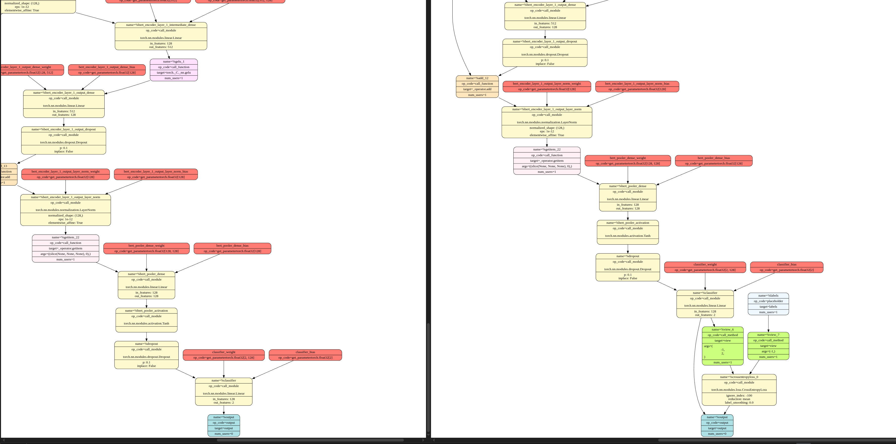
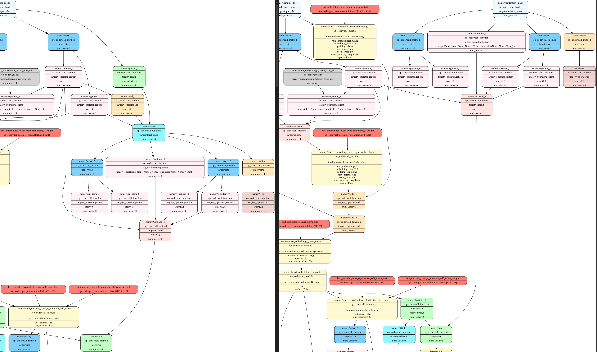
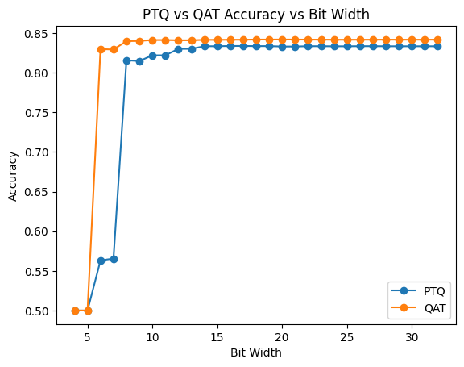
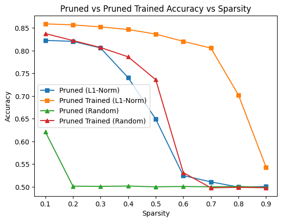
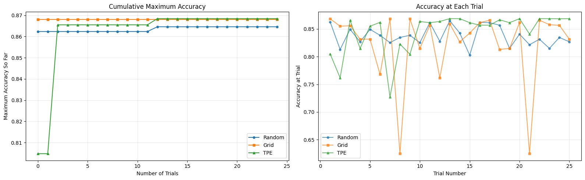
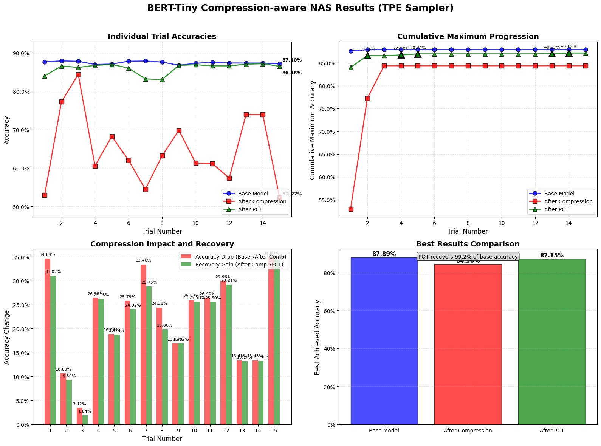

# LAB 0

## Tutorial 1 key points:

* overview of MG Nodes
* basic passes (analysis / transform)

## Tutorial 2:

1) setup MG - selecting which inputs of the forward pass function to use. 
2) the topology of the graph with attention mask + labels vs without:

with:
[link to all labels graph](mdassets/mg.bert-all-labels.svg)
without:
[link to no labels graph](mdassets/mg.bert-no-attention_mask-no-labels.svg)
Comparision:

  * labels: adds nodes to the bottom of the graph that takes the labels and finds the cross entropy loss

  * attention mask: adds placeholder node to get attention mask (without it uses torch.ones), which is used to inform the attention layer.
  * From the graph we know that 3 input is required for training, but 1 input is batter for inference.

3) then did full supervised finetuneing (on layers that aren't embedding related) achieving 0.81 accuracy
4) finally did PEFT achieving 0.83 accuracy


# LAB 1

## Tutorial 3:

* quantization pass: accuracy went `0.83` -> `0.815`
* PQT: accuracy `0.815` -> `0.839`

## Tutorial 4:

* Random pruneing: `0.839` -> `0.75`
* After training: `0.75` -> `0.83`

## Quantisation / pruning sweeps

* did a sweep of quantization bit-widths:

* we can see that after 8 bits, accuracy post training pretty much tapers off. Interestingly, huge amounts of accuracy are lost when quantising to 5/7 bits, which can be re-gained almost entirely with some training.

* next we did sweeps of various pruning sparsities using both l1-norm and random pruning as well as post prune training. 

* We can see that L1-pruning is far superior to random pruning. This makes sense as L1 pruning removes weight with small magnitude, meaning they likely don't have much impact on the output of the network regardless.
* random pruning appears to be very destructive without post training
* we can infer that roughly 70% of weights are not critical for high accuracy
* interestingly l1-pruning seems to perform similarly to random pruning and training implying that the lost weights' behaviour are re-learned. 
* random pruning clearly removes some important paths that can't be re-learned.
* I think that what is considered the "best" pruning sparsity really depends on how much you care about model size. 0.7 sparsity is certainly best for compression, but if the additional accuracy is important to you're use case, anything form 0.3 - 0.5 is reasonable. For the purposes of future labs, we will use 0.7.

# LAB 2


* first we tried tried 3 different samplers to see which is the most effective after a certain number of trials

* we found that grid shows some some oscillating behaviour as it sweeps systematically through all configurations, regularly hitting both quite promising and quite poor configurations
* random sample produced random configurations that tend to have a relatively average performance
* TPE seems to perform poorly at first, but as time progresses seems to start only trying effective configurations - implying that with more trials it would eventually converge on only very promising solutions.

* Because performance of hyperparameters might be different after compression, we ran a TPE sampled hyperparameter search measuring performance after training, compression and post compression training. The objective function was based on post compression training.

>>>>>>> bca7542 (lab2)

# LAB 3

## Question 1

In the original tutorial, all layers shared the same fixed-point configuration. I modified the search space to accept widths and fract_widths.

```python
search_space_task1 = {
    "linear_layer_choices": [torch.nn.Linear, LinearInteger],
    "widths": [8, 16, 32],
    "frac_widths": [2, 4, 8]
}

```

After allowing different layers to have the extra widths, and exposing this as a parameter to optuna, we got the following graph - optuna was able to an excellent set after a few issues and more trials didn't increase the accuracy.


This brought the accuracy up to 87.7%.

This is due to early layers (feature extractors) and late layers (classification heads) having different sensitivities to quantization noise. Optuna also is efficient in searching, showing why we reached such a good configuration early.

## Question 2

We've extended this to run searches in different precisions - we can see that BlockFP performs best, followed by Minifloat, Binary, and then Integer.


BlockFP achieved the highest accuracy due to sharing an exponent across a block of numbers, meaning it can capture a wider dynamic range than standard Integer fixed-point while maintaining the hardware efficiency of fixed-point arithmetic.
Minifloat is also very good due to the exponent bits allowing it to represent small numbers
Binary is fast to converge but has a low accuracy ceiling.
Integer performed badly due to low dynamic range.
The accuracy for Log is zero due to the zero weight, but this could be made a parameter
Again we can see that more iterations help, but after a certain point don't help due to having found a very good configuration

We also did a test for all 11 types with larger trails with highest accuracy `0.87564`.

[Link to best model's architecture](./lab3/best_mixed_precision_model_architecture.txt)
## Lab 4

### Question 1:

#### case: CPU

Original model: `0.9344 s`

Optimized model: `2.5768 s`

much slower! The possible reasons:

1) ResNet-18 is dominated by convolution layers, which are already highly optimized in PyTorch eager mode using oneDNN on CPU. TorchInductor primarily benefits models with heavy pointwise operations or fusion opportunities. For convolution-heavy models, the generated code often cannot outperform optimized vendor libraries.

2) My cpu is Intel i7-12700KF, which has multi cpus. Different execution paths may use different threading strategies. TorchInductor and eager mode can interact differently with OpenMP or oneDNN thread pools, sometimes leading to oversubscription or inefficient core utilization, which can degrade performance.

3) torch.compile is jit compilation. This introduced compilation overhead for each bytecode execution.

#### case: GPU

GPU Original model: `0.0411 s`

GPU Optimized model: `0.3081 s`

even much more slower! The possible reasons:
1) During compiling trail, I got some warning as output, this may be due to some overhead happed when the compile run the model.forward in first time, for example. looking for correct library and the low level apis (pynvml). And also during the backend searching or loading, the compile decide to used some bad backends.

2) Maybe there are other threads are using the GPU and the GPU is too busy to run the trail.

#### case: after warmup
After the two initial trail, I ran it again in notebook, the result is much better.

CPU Original model: `0.9321 s`

CPU Optimized model: `0.7850 s`

GPU Original model: `0.0214 s`

GPU Optimized model: `0.0213 s`


1) The possible case is that the model is being cache inside the device and the compiled path is also cached, no more jit graph break and recompiling happened in the runtime.

### Question 2

- a: rewrite the time_model function and get_data function. And usd the same qkv for both cpu and gpu. Load to correct device before get_data call.
- b: The result is as follow:

CPU Original attention: `0.147642 s`

CPU Fused attention: `0.002589 s`

GPU Original attention: `0.000087 s`

GPU Fused attention: `0.000031 s`

The fusion dose increase the speed a lot. And compare GPU to CPU, the speed increases is limited but still double the speed. This may be the memory bandwidth on GPU is much larger than CPU and the speed up inferred that the original attention is indeed limited by the memory bottleneck.

### Question 3

#### Question 1
**Q:** How does MXINT8 benefit custom hardware if both the activation and weights in a linear layer are quantized to MXINT8?

**A:** The MXINT8 is much hardware friendly, in two aspect. One is integer computation  is simple in hardware and the other is it reduce the data size and so dose reduce the data throughput for a given memory bandwidth. 
- In hardware design aspect, the hardware the computation of FP number is much complicated and usually require multiple cycles to complete the computation which reduce the IPS. And large batch of FP computation will result in speed decreasing multiple times. How ever if we use MXINT to quantise FP numbers, the processing elements in tensor core or vector unit can using integer MAC units which can finish computation in smaller cycles or even in one cycle other than multiple cycles in FP unit.
- And in dataflow aspect, if the memory width is 32 bits, the effective memory bandwidth will be 4 times larger.
## b) Dequantise kernel 
There are a series of steps to convert a quantised MXINT8 to bfloat16.
MXINT8 and bfloat16 have different interpretations of how the mantissa is laid out.

The bfloat16 mantissa section only encodes the value after the decimal point and the $2^0$ position is always treated as 1.

MXINT8 does not and cannot do this as the exponent is shared between multiple numbers and the only way to encode a discrepancy in exponent is have the mantissa denormalised.

### Question 2
The dequantisation converts form a number where normalisation isn't enforced to one where it is. 
```c
auto bias = cutlass::bfloat16_t::bitcast(sign | exp | uint16_t(0));
auto frac = static_cast<uint16_t>((mantissa_abs & 0x3F) << 1);
auto out = cutlass::bfloat16_t::bitcast(sign | exp | frac);
```
The `0x3F` mask takes the 6 LSBs of the 7 bit MXINT8 mantissa and creates a bfloat16 through a bitcast. This has implicitly assumed that the $2^0$ position is 1.

```c
auto dont_need_bias = bool(mantissa_abs & 0x40);
tXrY[i] = dont_need_bias ? out : out - bias;
```
Which is why the case is tested for and the bias is applied if the $2^0$ position was 0.

$bias = (-1)^{sign} \times 2^{exponent} \times (1 + mantissa/2^7)$

The bitrange of the bias mantissa is set to 0' but the resulting number represents 1.0 scaled by the exponent.

#### Question 3
**Q:** How does `cta_tiler` partition the data for copy?

**A:** the cta_tiler is used to prepare different section of memory i.e. a tile for different Compute Thread Arrays. While call local_tile, we need to pass the shape for each tile and the cta_tiler is the shape (BLK_M, BLK_K). With it, cta_coor will also being passed to local_tile, this is to indicate the cta location, that is which thread will used the tile. The local_tile dose not copy the data, but only return a Tensor view, i.e. a pointer to the memory section.

**Q:** How does layout_sX partition the threads in a threadblock for computation?
**A:** layout_sX defines a 2D mapping from threadIdx.x to (m, k) coordinates inside the CTA tile, so that each thread in the block is assigned ownership of exactly one (m, k) element in the shared-memory tile.

#### Predication
Predication is an important part of the kernel is used as a means to keep the kernel the exact same across threads but allow it to work on non standard sized input tensors.
DimBlock may not perfectly divide the input task (Dimensions group_size $\times$ num_groups). So the grid is launched such that the number of blocks launched tile to be larger than the input. Predication is applied on the Gmem, Smem transfers using `copy_if(predication_map, src, dst)`.  

#### Question 4
**Q:** Why the saved GPU memory is not exactly (32 - (4+8/32))/32 = 86.7% of the FP32 model?
**A:** 
```python
    for layer_name, layer in model.named_modules():
        if not isinstance(layer, torch.nn.Linear):
            continue
        if "classifier" in layer_name:
            continue
        layer.cuda()
        layer_q = QLinearPacked.build_from_linear(layer, group_size=mxint8_group_size)
        set_layer_by_name(model, layer_name, layer_q)
        del layer
        torch.cuda.empty_cache()
```
From this section we know that we are only quantize the torch.nn.Linear layer. There are other layer that are not being quantized for example encoder, pooling and classifer.


